# Endpoint Visual Maps and Metrics

Source: backend/main.py

## GET /api/teams/logos
Metrics:
- method: GET
- auth: none
- idempotent: yes
- side effects: none
- data sources: team_logos.csv (cached in memory)

Data In:
- path: none
- query: none
- body: none

Data Out (JSON):
- teams: object<string, TeamMeta>
- TeamMeta: { logoUrl: string, name?: string, primaryColor?: string, secondaryColor?: string, wordmark?: string, conference?: string, division?: string }

Visual Map (Mermaid):
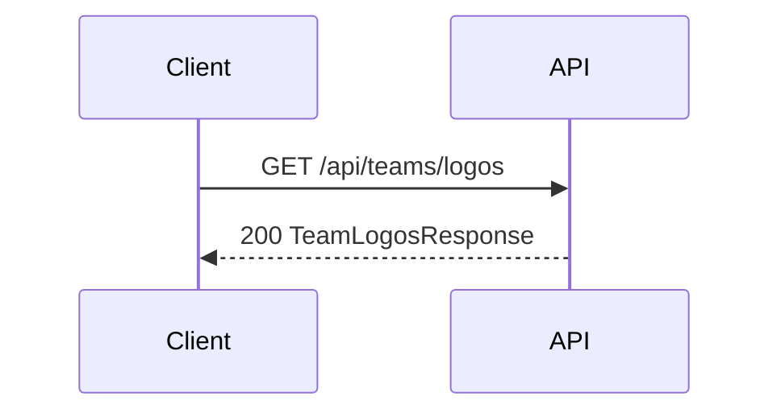

Visual Map (Static):
```
[Client] -> [GET /api/teams/logos] -> [teams{abbr:meta}]
```

## GET /api/teams/{team_abbr}
Metrics:
- method: GET
- auth: none
- idempotent: yes
- side effects: none
- data sources: backend/data/team_logos.csv (and optional team_logo.csv)

Data In:
- path: team_abbr: string
- query: none
- body: none

Data Out (JSON):
- TeamAsset: { team_abbr, team_name?, team_color?, team_color2?, preferred_logo?, logo_svg?, wordmark?, logo_espn?, logo_wikipedia? }

Visual Map (Mermaid):
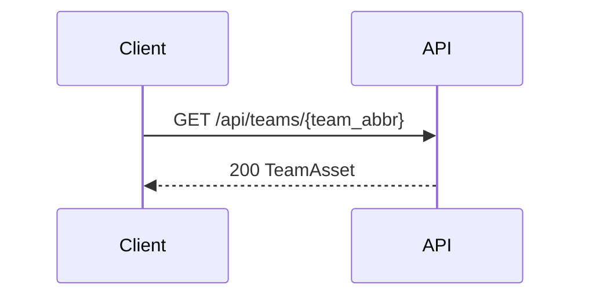

Visual Map (Static):
```
[Client] -> [GET /api/teams/{team_abbr}] -> [TeamAsset]
```

## GET /api/health
Metrics:
- method: GET
- auth: none
- idempotent: yes
- side effects: none
- data sources: in-memory service readiness

Data In:
- path: none
- query: none
- body: none

Data Out (JSON):
- HealthResponse: { status: string, mode: string, reason: string }

Visual Map (Mermaid):
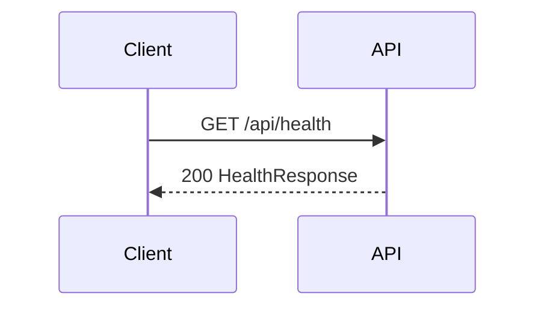

Visual Map (Static):
```
[Client] -> [GET /api/health] -> [status, mode, reason]
```

## GET /api/status/overview
Metrics:
- method: GET
- auth: none
- idempotent: yes
- side effects: none
- data sources: dataset in memory, prediction history

Data In:
- path: none
- query: none
- body: none

Data Out (JSON):
- StatusOverviewResponse
- health: HealthResponse
- dataset: { rows: number, features: number }
- history: { total_predictions: number, win_rate?: number, note?: string }

Visual Map (Mermaid):
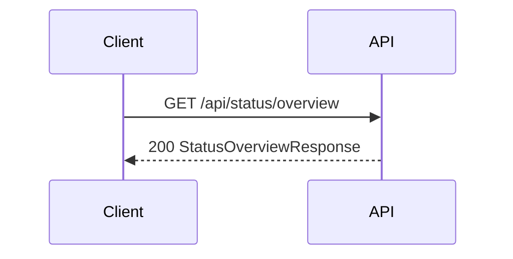

Visual Map (Static):
```
[Client] -> [GET /api/status/overview] -> [health + dataset + history]
```

## GET /api/status/models
Metrics:
- method: GET
- auth: none
- idempotent: yes
- side effects: none
- data sources: model metadata in memory

Data In:
- path: none
- query: none
- body: none

Data Out (JSON):
- health: string
- models_dir: string
- metadata_path: string
- dataset_path: string
- expected_features_count: number
- expected_features_sample: string[]
- metadata: object

Visual Map (Mermaid):
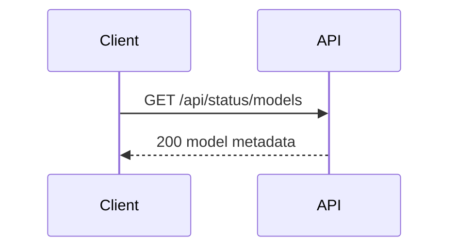

Visual Map (Static):
```
[Client] -> [GET /api/status/models] -> [metadata + feature list]
```

## GET /api/debug
Metrics:
- method: GET
- auth: none
- idempotent: yes
- side effects: none
- data sources: dataset in memory

Data In:
- path: none
- query: none
- body: none

Data Out (JSON):
- status: string
- timestamp: string
- config: { models_dir: string, data_dir: string, offline_mode: string }
- dataset_info: { rows: number, cols: number, shape: [number, number], sample_cols: string[] }

Visual Map (Mermaid):
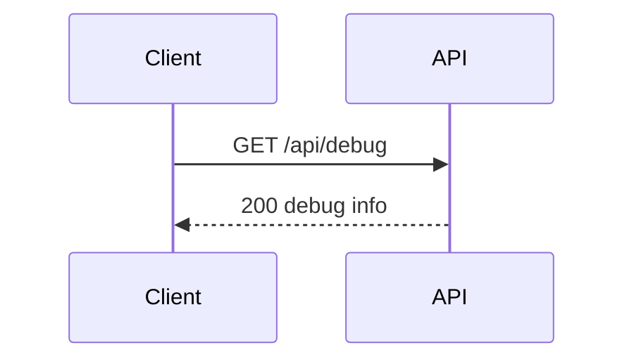

Visual Map (Static):
```
[Client] -> [GET /api/debug] -> [config + dataset_info]
```

## POST /api/predict
Metrics:
- method: POST
- auth: none
- idempotent: mostly (writes history when record=true)
- side effects: appends to prediction history (record=true)
- data sources: models + dataset in memory

Data In:
- query: record?: boolean (default true)
- body (JSON): { home_team: string, away_team: string, season: number, week: number }

Data Out (JSON): UnifiedPredictionResponse
- home_score: number
- away_score: number
- point_diff: number
- home_win_probability: number
- away_win_probability: number
- prediction_source: string
- win_classifier_used: boolean
- simulation_metrics: object | null
- game_id: string
- season: number
- week: number
- home_team: string
- away_team: string
- home_name?: string
- away_name?: string

Visual Map (Mermaid):
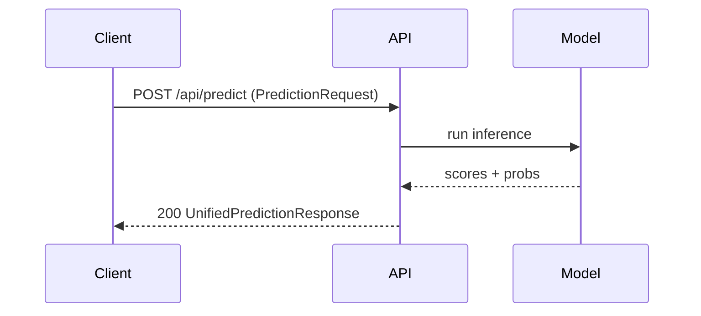

Visual Map (Static):
```
[Client] -> [POST /api/predict] -> [Model Inference] -> [Prediction JSON]
```

## POST /api/predict/explain
Metrics:
- method: POST
- auth: none
- idempotent: yes (best effort LLM call)
- side effects: none
- data sources: optional model inference + Ollama

Data In:
- body (JSON) options:
  - Option A: { prediction: UnifiedPredictionResponse-like }
  - Option B: { home_team, away_team, season, week }
  - Option C: flat prediction fields { home_score, away_score, home_win_probability, ... }

Data Out (JSON):
- game_id: string | null
- used_llm: boolean
- llm_model: string | null
- explanation: string
- bullets: string[]
- caveats: string[]
- error: string | null

Visual Map (Mermaid):
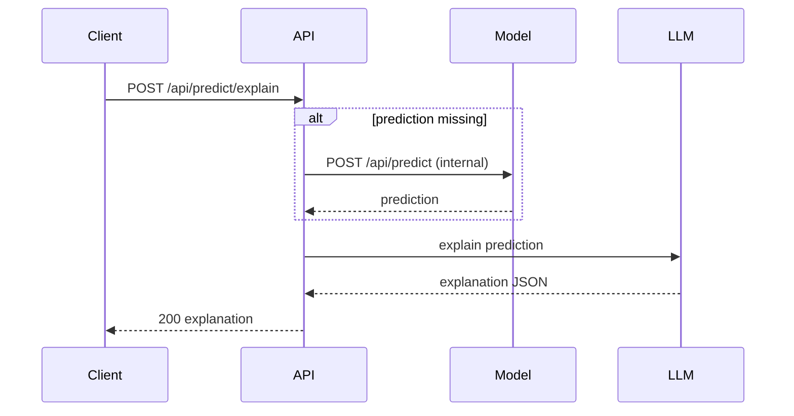

Visual Map (Static):
```
[Client] -> [predict/explain] -> [optional predict] -> [LLM] -> [explanation]
```

## GET /api/schedule/next-week
Metrics:
- method: GET
- auth: none
- idempotent: yes
- side effects: none
- data sources: schedule CSV or nflreadpy

Data In:
- query: season?: number
- path: none
- body: none

Data Out (JSON):
- games: ScheduleEntry[]
- ScheduleEntry: { home_team, away_team, season, week, kickoff?, game_id?, home_abbr?, away_abbr?, home_logo?, away_logo?, home_name?, away_name?, stadium? }

Visual Map (Mermaid):
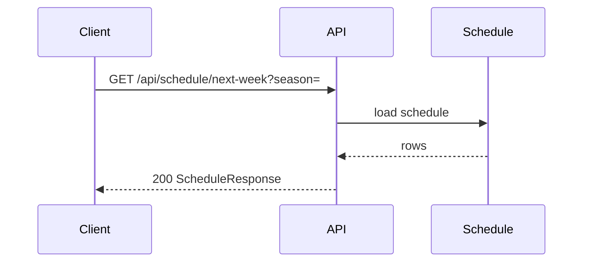

Visual Map (Static):
```
[Client] -> [GET /api/schedule/next-week] -> [Schedule Data] -> [games[]]
```

## GET /api/history
Metrics:
- method: GET
- auth: none
- idempotent: yes
- side effects: none
- data sources: prediction_history in memory/disk

Data In:
- query: limit?: number (default 100)
- path: none
- body: none

Data Out (JSON):
- entries: HistoryEntry[]
- total: number
- HistoryEntry: UnifiedPredictionResponse fields + ts: string

Visual Map (Mermaid):
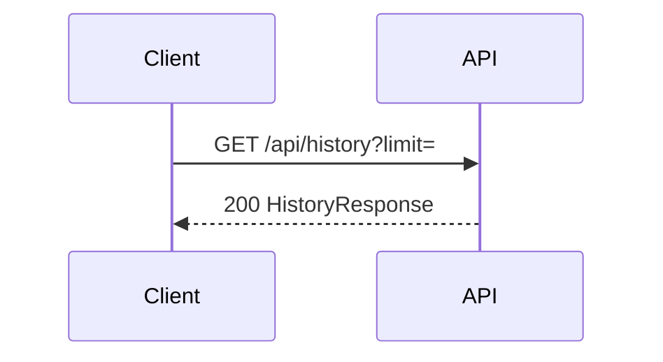

Visual Map (Static):
```
[Client] -> [GET /api/history] -> [entries[] + total]
```

## POST /api/llm/chat
Metrics:
- method: POST
- auth: none
- idempotent: yes (best effort LLM call)
- side effects: none
- data sources: Ollama

Data In:
- body (JSON):
  - messages: { role: string, content: string }[]
  - prediction?: object (used to build system prompt)

Data Out (JSON):
- reply: string
- used_llm: boolean
- llm_model: string | null
- error: string | null

Visual Map (Mermaid):
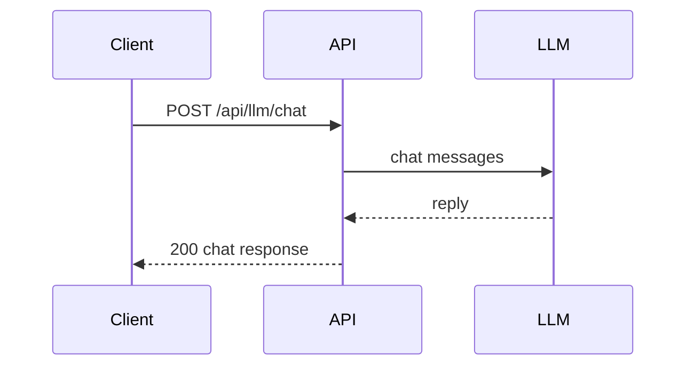

Visual Map (Static):
```
[Client] -> [POST /api/llm/chat] -> [LLM] -> [reply]
```

## POST /api/admin/reload
Metrics:
- method: POST
- auth: admin only (ENABLE_ADMIN)
- idempotent: yes
- side effects: reloads models and dataset into memory
- data sources: model artifacts + dataset on disk

Data In:
- path: none
- query: none
- body: none

Data Out (JSON):
- reloaded: true
- models_dir: string

Visual Map (Mermaid):
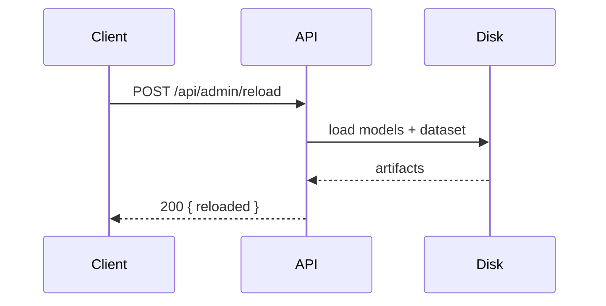

Visual Map (Static):
```
[Client] -> [admin/reload] -> [Disk Load] -> [ready]
```

## POST /api/admin/retrain
Metrics:
- method: POST
- auth: admin only (ENABLE_ADMIN)
- idempotent: no (triggers training)
- side effects: trains models and reloads them
- data sources: dataset CSV + training pipeline

Data In:
- body (JSON): { dataset_path?: string }

Data Out (JSON):
- trained: true

Visual Map (Mermaid):
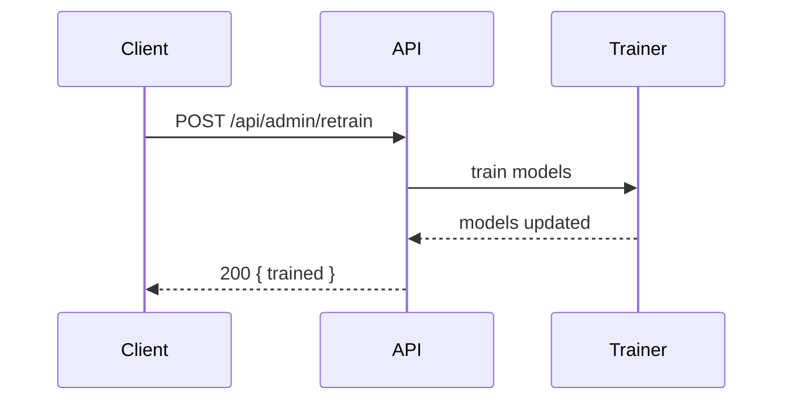

Visual Map (Static):
```
[Client] -> [admin/retrain] -> [Training] -> [reloaded]
```

## POST /api/debug/predict-input
Metrics:
- method: POST
- auth: none
- idempotent: yes
- side effects: none
- data sources: dataset in memory

Data In:
- body (JSON): { home_team: string, away_team: string, season: number, week: number }

Data Out (JSON):
- prediction_source: string
- debug: { cols_before_align?: number, missing_before_impute?: number, cols_final?: number, missing_final?: number }

Visual Map (Mermaid):
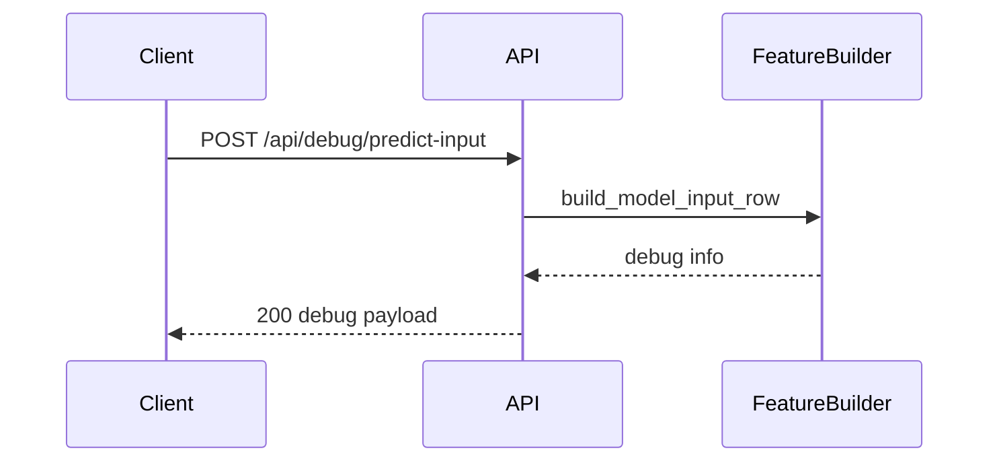

Visual Map (Static):
```
[Client] -> [debug/predict-input] -> [feature row debug] -> [debug stats]
```
