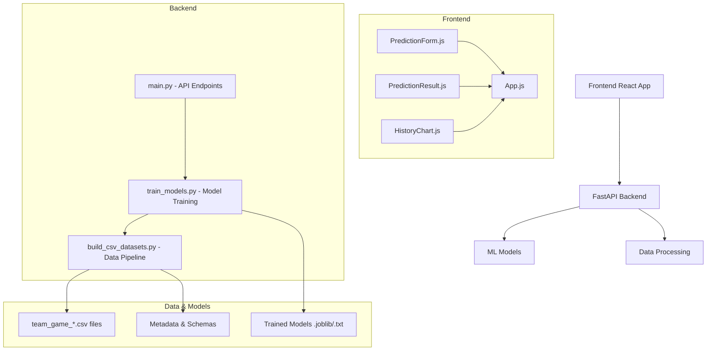

# NFL Prediction System Codebase Analysis

## Overview

Your codebase implements a full-stack NFL game prediction system that uses machine learning to predict the probability of a home team winning based on team-game statistics. The system consists of:

- **Backend**: FastAPI service with ML model inference
- **Frontend**: React web application for user interaction
- **Data Pipeline**: Scripts to build and process historical NFL data
- **Models**: Trained neural network and gradient boosting models

## Architecture Diagram



## Project Structure

```mermaid
nfl_prediction_system/
├── README.md                    # Project overview and usage
├── requirements.txt             # Python dependencies
├── backend/
│   ├── main.py                  # FastAPI application
│   ├── train_models.py          # Model training script
│   ├── data/
│   │   ├── team_game_base.csv   # Raw team-game data
│   │   ├── team_game_iter1.csv  # Processed iteration 1
│   │   ├── team_game_iter2.csv  # Processed iteration 2
│   │   ├── team_game_iter3.csv  # Final processed data
│   │   └── model_metrics.txt    # Training metrics
│   ├── models/
│   │   ├── preprocessor.joblib  # Data preprocessor
│   │   ├── nn_model.joblib      # Neural network model
│   │   ├── gbm_model.txt        # Gradient boosting model
│   │   ├── scaler.joblib        # Feature scaler
│   │   └── metadata.json        # Model metadata
│   └── scripts/
│       ├── build_csv_datasets.py # Data pipeline script
│       ├── make_schema.py       # Schema generator
│       └── enriched/            # Additional data files
├── frontend/
│   ├── package.json             # Node.js dependencies
│   ├── public/
│   │   └── index.html           # HTML template
│   └── src/
│       ├── App.js               # Main React component
│       ├── index.js             # React entry point
│       ├── styles.css           # Custom styles
│       └── components/
│           ├── PredictionForm.js    # Input form
│           ├── PredictionResult.js  # Result display
│           └── HistoryChart.js      # Prediction history
```

## Key Components

### Backend (FastAPI)

**Main API Endpoints:**

- `/predict` - Predict win probability for a game
- `/predict_raw` - Raw prediction with full features
- `/retrain` - Retrain models on latest data
- `/health` - Health check

**Model Loading Strategy:**

- Lazy loading of heavy dependencies (numpy, pandas, scikit-learn, lightgbm)
- Fallback to heuristic if models unavailable
- Automatic model selection based on availability

### Frontend (React)

**Components:**

- App.js - Main application state management
- PredictionForm.js - User input form for game statistics
- `PredictionResult.js` - Display prediction results
- `HistoryChart.js` - Chart of prediction history

**Features:**

- Axios for API communication
- Chart.js for data visualization
- Proxy configuration for local development

### Data Pipeline

**Processing Steps:**

1. Raw data from nfl-data-py
2. Feature engineering iterations
3. Schema generation (JSON + Markdown)
4. Model training data preparation

### Machine Learning Models

**Models Trained:**

- Neural Network (MLPClassifier)
- Gradient Boosting (LightGBM)
- Feature preprocessing pipeline

**Features Used:**

- Passer ratings
- Turnovers
- Rushing yards
- Team identifiers (one-hot encoded)
- Historical performance metrics

## Technology Stack

| Component | Technology | Purpose |
|-----------|------------|---------|
| Backend API | FastAPI + Uvicorn | REST API server |
| ML Framework | Scikit-learn + LightGBM | Model training/inference |
| Data Processing | Pandas + NumPy | Data manipulation |
| Frontend | React + Axios | User interface |
| Visualization | Chart.js | Data charts |
| Data Source | nfl-data-py | NFL historical data |

## Data Flow

1. **Data Collection**: Historical NFL game data via nfl-data-py
2. **Feature Engineering**: Multiple iterations of data processing
3. **Model Training**: NN and GBM models trained on processed data
4. **API Serving**: Models loaded and served via FastAPI
5. **User Interaction**: React frontend collects inputs and displays predictions
6. **Retraining**: Endpoint to update models with new data

## Key Files Analysis

### main.py

- FastAPI application setup
- Model loading with fallback mechanism
- Prediction endpoints with input validation
- Retraining endpoint

### train_models.py

- Data preprocessing pipeline
- Neural network and GBM training
- Model artifact saving
- Performance metrics calculation

### App.js

- State management for predictions and history
- API communication handling
- Component orchestration

### `scripts/build_csv_datasets.py`

- Data pipeline orchestration
- Multiple processing iterations
- Schema file generation

This codebase represents a well-structured ML application with clear separation of concerns, proper error handling, and production-ready features like model fallbacks and retraining capabilities.
