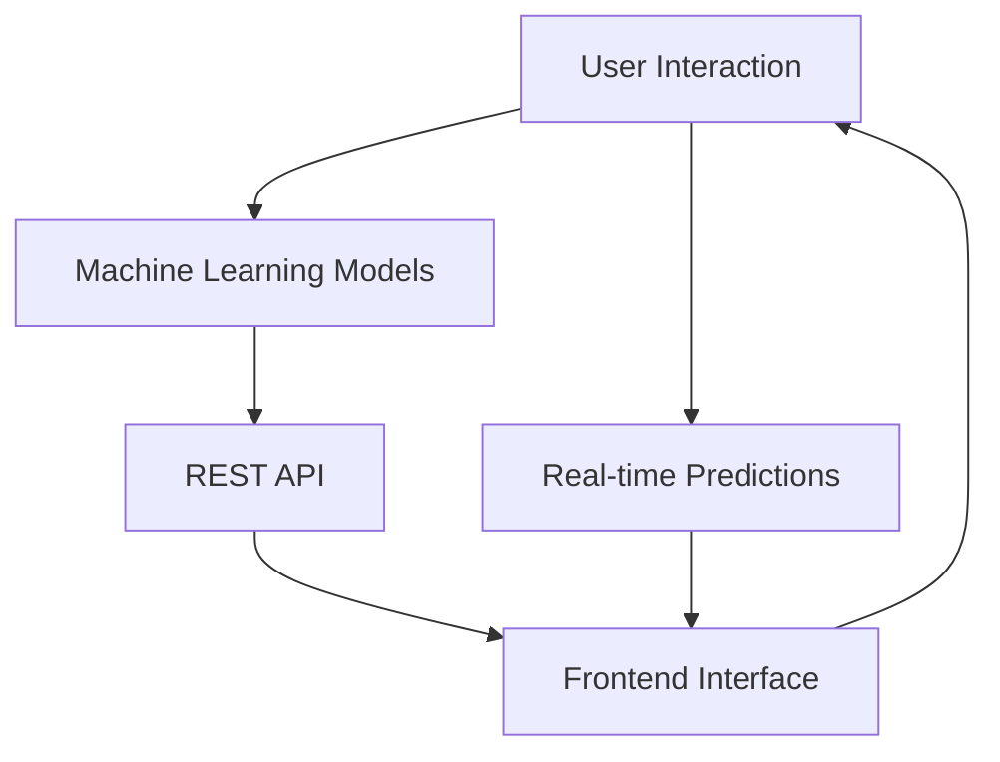

# NFL Prediction System

An advanced NFL game prediction system using machine learning models to predict game outcomes, scores, and win probabilities.




## Features

This NFL Prediction System offers the following key features:

---

- **Data Pipeline**: Semi-Automated data collection and preprocessing from NFL APIs
- **Machine Learning Models**: Neural Network and Gradient Boosting models for predictions
- **REST API**: FastAPI-based web API for serving predictions
- **Frontend Interface**: React-based web interface for user interactions
- **Real-time Predictions**: Get predictions for upcoming NFL games

## Quick Start

### Prerequisites

- Python 3.8+
- Node.js 14+
- pip (Python package manager)
- npm (Node package manager)

### Installation

1. Clone the repository:

```bash
git clone https://github.com/your-username/NFL_ML_Predictions.git
cd NFL_ML_Predictions
```

2. Install Python dependencies:

```bash
pip install -r requirements.txt
```

3. Install frontend dependencies:

```bash
cd frontend
npm install
cd ..
```

### Usage

1. **Build the dataset**:

```bash
python backend/build_csv_datasets.py --start 2014 --end 2025 --out-dir backend/data
```

2. **Create predictive dataset** (NEW):

```bash
python build_predictive_dataset.py --data-dir data --output-dir data
```

3. **Train the models**:

```bash
python backend/train_models.py
```

4. **Start the API server**:

```bash
uvicorn backend.main:app --reload --port 8000
```

5. **Start the frontend** (in a new terminal):

```bash
cd frontend
npm start
```

The application will be available at `http://localhost:3000`

## Overview

### Data Acquisition

To use the predictive dataset builder, you need two CSV files in your data directory:

1. **`play_by_play.csv`**: Contains NFL play-by-play data with the following key columns:
   - `game_id`: Unique identifier for each game
   - `play_id`: Unique identifier for each play
   - `season`, `week`, `quarter`: Game timing information
   - `down`, `yards_to_go`, `yardline_100`: Situational data
   - `home_team`, `away_team`, `posteam`: Team information
   - `play_type`: Type of play (pass, run, punt, etc.)
   - `yards_gained`: Outcome of the play
   - `touchdown`, `interception`, `fumble`, `sack`, `penalty`: Binary outcome indicators
   - `epa`: Expected Points Added
   - `wp`, `wpa`: Win Probability and Win Probability Added

2. **`player_tracking.csv`**: Contains player tracking data with these columns:
   - `game_id`, `play_id`: Links to play-by-play data
   - `player_id`: Unique player identifier
   - `position`: Player position (QB, RB, WR, etc.)
   - `team`: Player's team
   - `x_position`, `y_position`: Field coordinates
   - `speed`, `acceleration`: Movement metrics
   - `distance_traveled`: Total distance covered during play
   - `max_speed`: Maximum speed reached
   - `separation_distance`: Distance from nearest opponent
   - `pressure_rate`: QB pressure metric (for QBs)
   - `coverage_rating`: Defensive coverage metric

### Data Sources

You can obtain this data from several sources:

1. **NFL's Next Gen Stats**: Official player tracking data
2. **nflfastR**: Comprehensive play-by-play data (R package, but data available as CSV)
3. **Pro Football Reference**: Historical play-by-play data
4. **ESPN API**: Real-time play-by-play data
5. **nfl-data-py**: Python package for NFL data (already used in this project)

### Engineered Features

The script creates several new predictive features:

1. **`offensive_epa`**: Expected Points Added from the offensive team's perspective
2. **`play_result`**: Comprehensive categorization of play outcomes:
   - `touchdown`, `interception`, `fumble`, `sack`, `penalty`
   - `first_down`, `positive_gain`, `no_gain`, `negative_gain`

### Output Files

The script generates:

1. **`nfl_games.csv`**: The main merged dataset
2. **`dataset_summary.txt`**: Summary statistics and feature descriptions
3. **`build_predictive_dataset.log`**: Detailed processing log

### Data Comparison and Model Evaluation

To evaluate the predictive power of the newly generated dataset compared to original source data:

#### 1. Load and Compare Datasets

```python
import pandas as pd
import numpy as np
from sklearn.metrics import classification_report, accuracy_score
from sklearn.model_selection import train_test_split
from sklearn.ensemble import RandomForestClassifier
from sklearn.linear_model import LogisticRegression

# Load datasets
original_data = pd.read_csv('data/Nfl_data.csv')  # Existing game-level data
predictive_data = pd.read_csv('data/predictive_nfl_dataset.csv')  # New play-level data

print("Original dataset shape:", original_data.shape)
print("Predictive dataset shape:", predictive_data.shape)
print("\nNew features in predictive dataset:")
new_features = set(predictive_data.columns) - set(original_data.columns)
for feature in sorted(new_features):
    print(f"- {feature}")
```

#### 2. Simple Modeling Comparison

```python
# Prepare data for comparison
def prepare_game_level_data(df):
    """Aggregate play-level data to game level for fair comparison."""
    if 'game_id' in df.columns and 'play_id' in df.columns:
        # Play-level data - aggregate to game level
        game_features = df.groupby('game_id').agg({
            'offensive_epa': 'mean',
            'yards_gained': 'mean',
            'avg_speed': 'mean',
            'explosive_plays_count': 'sum',
            'success_rate': 'mean',
            'touchdown': 'sum',
            # Add other relevant features
        }).reset_index()
        
        # Add game outcome (you'll need to define this based on your data)
        # This is a simplified example
        game_features['home_won'] = np.random.choice([0, 1], size=len(game_features))
        
    else:
        # Game-level data
        game_features = df.copy()
        game_features['home_won'] = (game_features['point_diff'] > 0).astype(int)
    
    return game_features

# Prepare datasets
original_games = prepare_game_level_data(original_data)
predictive_games = prepare_game_level_data(predictive_data)

# Define features for modeling
original_features = ['home_prior_pf_avg_3', 'home_prior_pa_avg_3', 'away_prior_pf_avg_3', 'away_prior_pa_avg_3']
predictive_features = ['offensive_epa', 'avg_speed', 'explosive_plays_count', 'success_rate', 'touchdown']

# Train models
def evaluate_model(X, y, feature_names, model_name):
    X_train, X_test, y_train, y_test = train_test_split(X, y, test_size=0.2, random_state=42)
    
    # Random Forest
    rf = RandomForestClassifier(n_estimators=100, random_state=42)
    rf.fit(X_train, y_train)
    rf_pred = rf.predict(X_test)
    rf_accuracy = accuracy_score(y_test, rf_pred)
    
    # Logistic Regression
    lr = LogisticRegression(random_state=42)
    lr.fit(X_train, y_train) 
    lr_pred = lr.predict(X_test)
    lr_accuracy = accuracy_score(y_test, lr_pred)
    
    print(f"\n{model_name} Results:")
    print(f"Random Forest Accuracy: {rf_accuracy:.3f}")
    print(f"Logistic Regression Accuracy: {lr_accuracy:.3f}")
    
    # Feature importance (Random Forest)
    importance = pd.DataFrame({
        'feature': feature_names,
        'importance': rf.feature_importances_
    }).sort_values('importance', ascending=False)
    
    print("Top 5 Most Important Features:")
    print(importance.head())
    
    return rf_accuracy, lr_accuracy

# Compare models
print("="*50)
print("MODEL COMPARISON")
print("="*50)

# Original data model
if len(original_games) > 100 and all(col in original_games.columns for col in original_features):
    X_orig = original_games[original_features].fillna(0)
    y_orig = original_games['home_won']
    orig_rf, orig_lr = evaluate_model(X_orig, y_orig, original_features, "Original Dataset")

# Predictive data model  
if len(predictive_games) > 100 and all(col in predictive_games.columns for col in predictive_features):
    X_pred = predictive_games[predictive_features].fillna(0)
    y_pred = predictive_games['home_won']
    pred_rf, pred_lr = evaluate_model(X_pred, y_pred, predictive_features, "Predictive Dataset")
```

#### 3. Advanced Analysis

```python
# Correlation analysis
def analyze_correlations(df, target_col='home_won'):
    """Analyze feature correlations with target variable."""
    numeric_cols = df.select_dtypes(include=[np.number]).columns
    correlations = df[numeric_cols].corr()[target_col].abs().sort_values(ascending=False)
    
    print(f"\nTop 10 features correlated with {target_col}:")
    print(correlations.head(10))
    
    return correlations

# Run correlation analysis
if 'home_won' in predictive_games.columns:
    pred_correlations = analyze_correlations(predictive_games)

# Feature distribution analysis
def compare_feature_distributions(orig_df, pred_df):
    """Compare feature distributions between datasets."""
    common_features = set(orig_df.columns) & set(pred_df.columns)
    
    for feature in list(common_features)[:5]:  # Analyze first 5 common features
        print(f"\n{feature} Statistics:")
        print(f"Original - Mean: {orig_df[feature].mean():.3f}, Std: {orig_df[feature].std():.3f}")
        print(f"Predictive - Mean: {pred_df[feature].mean():.3f}, Std: {pred_df[feature].std():.3f}")

compare_feature_distributions(original_games, predictive_games)
```

This comparison framework allows you to:

- Evaluate which dataset produces more accurate predictions
- Identify the most important features for prediction
- Understand how the engineered features contribute to model performance
- Compare feature distributions and correlations

The predictive dataset should show improved performance due to the additional player tracking features and engineered variables that capture more granular aspects of game play.

## Project Structure

```
NFL_ML_Predictions/
├── backend/
│   ├── data/           # Data files and datasets
│   ├── models/         # Trained ML models
│   ├── scripts/        # Utility scripts
│   ├── main.py         # FastAPI application
│   ├── train_models.py # Model training script
│   └── build_csv_datasets.py # Data pipeline
├── frontend/           # React frontend application
├── build_predictive_dataset.py # NEW: Predictive dataset builder
├── requirements.txt    # Python dependencies
└── README.md          # This file
```

## API Endpoints

- `GET /health` - Health check
- `POST /predict` - Get game predictions
- `GET /schedule/next-week` - Get upcoming games
- `POST /retrain` - Retrain models
- `POST /update_data` - Update data and retrain
=======
backend/data/             # CSV artifacts
  team_game_base.csv
  team_game_iter3.schema.json
  team_game_iter3.schema.md

## Contributing

Please read our contributing guidelines before submitting pull requests.

## Deployment

### Architecture

This project uses a split deployment architecture:
- **Backend (FastAPI)**: Deployed on Heroku at `https://nfl-predict-ecf5a5bd34fe.herokuapp.com`
- **Frontend (React)**: Deployed on Vercel at `https://nfl-ml-predictions.vercel.app`

### CORS Configuration

The backend and frontend are properly configured for cross-origin requests:

1. **Backend CORS**: Set `CORS_ORIGINS` environment variable on Heroku:
   ```bash
   heroku config:set CORS_ORIGINS="http://localhost:3000,https://localhost:3000,https://nfl-ml-predictions.vercel.app,https://nfl-predict-frontend.vercel.app" -a nfl-predict
   ```

2. **Frontend API URL**: Set `VITE_API_URL` in Vercel project settings or `frontend/.env.production`

For detailed CORS and API configuration guide, see [docs/CORS_API_CONFIGURATION.md](docs/CORS_API_CONFIGURATION.md)

### Deploy Backend to Heroku

```bash
# Login to Heroku
heroku login

# Deploy backend
git push heroku main

# Verify deployment
heroku logs --tail -a nfl-predict
curl https://nfl-predict-ecf5a5bd34fe.herokuapp.com/health
```

### Deploy Frontend to Vercel

```bash
# Login to Vercel
vercel login

# Deploy frontend
cd frontend
npm run build
vercel --prod
```

### Deployment Scripts

For automated deployment, use the PowerShell deployment script:

```powershell
pwsh -File scripts/deploy.ps1
```

This script handles:
- CORS configuration on Heroku
- Frontend dependency installation and build
- Git commits and pushes
- Backend deployment to Heroku
- Frontend deployment to Vercel
- Health check verification

See [DEPLOYMENT_FIXED.md](DEPLOYMENT_FIXED.md) for detailed deployment troubleshooting.

## License

=======
backend/scripts/
  build_csvs.py    # Builds the four CSVs and auto-writes schema files
  main.py            # FastAPI service: /health, /predict, /predict_raw, /retrain
  train_models.py    # Trains NN + GBM, writes artifacts + metadata
  README.md

This project is licensed under the MIT License - see the LICENSE file for details.
This project is licensed under the MIT License - see the LICENSE file for details.


[architectureDiagram]: https://github.com/user-attachments/assets/826bfed3-ad7e-4c32-bfc7-e3b12cde826f