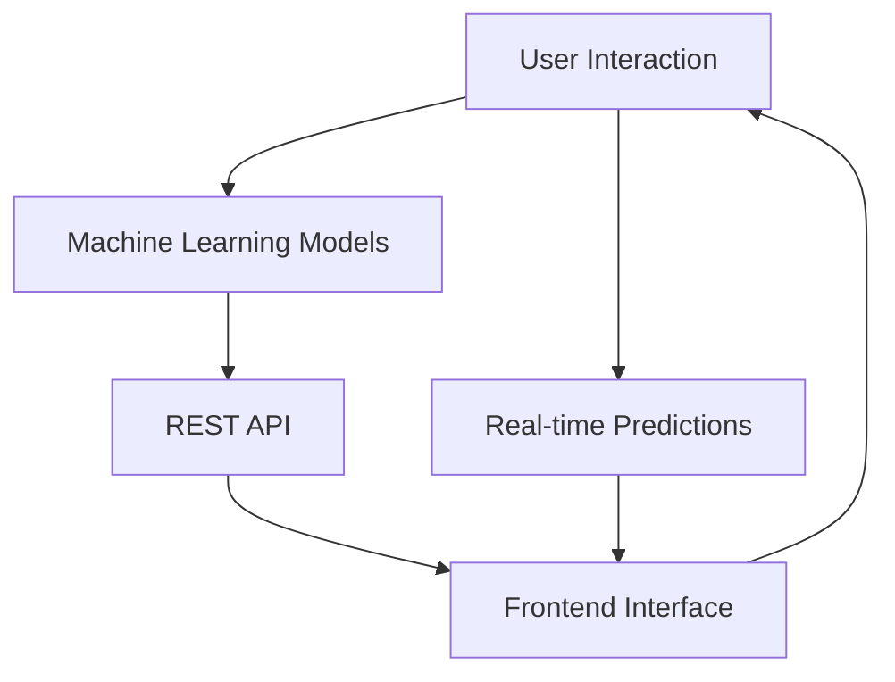

# NFL Prediction System

An advanced NFL game prediction system using machine learning models to predict game outcomes, scores, and win probabilities.




## Features

This NFL Prediction System offers the following key features:

---

- **Data Pipeline**: Semi-Automated data collection and preprocessing from NFL APIs
- **Machine Learning Models**: Neural Network and Gradient Boosting models for predictions
- **REST API**: FastAPI-based web API for serving predictions
- **Frontend Interface**: React-based web interface for user interactions
- **Real-time Predictions**: Get predictions for upcoming NFL games

## Quick Start

### Prerequisites

- Python 3.8+
- Node.js 14+
- pip (Python package manager)
- npm (Node package manager)

### Installation

1. Clone the repository:

```bash
git clone https://github.com/your-username/NFL_ML_Predictions.git
cd NFL_ML_Predictions
```

** 2. Install Python dependencies:

```bash
pip install -r requirements.txt
```

** 3. Install frontend dependencies:

```bash
cd frontend
npm install
cd ..
```

### Usage

1. **Build the dataset**:

```bash
python backend/build_csv_datasets.py --start 2018 --end 2025 --out-dir backend/data
```

** 2. **Create predictive dataset** (NEW):

```bash
python build_predictive_dataset.py --data-dir data --output-dir data
```

** 3. **Train the models**:

```bash
python backend/train_models.py
```

** 4. **Start the API server**:

```bash
uvicorn backend.main:app --reload --port 8000
```

** 5. **Start the frontend** (in a new terminal):

```bash
cd frontend
npm start
```

The application will be available at `http://localhost:3000`

## Overview

### Data Acquisition

To use the predictive dataset builder, you need two CSV files in your data directory:

1. **`play_by_play.csv`**: Contains NFL play-by-play data with the following key columns:
   - `game_id`: Unique identifier for each game
   - `play_id`: Unique identifier for each play
   - `season`, `week`, `quarter`: Game timing information
   - `down`, `yards_to_go`, `yardline_100`: Situational data
   - `home_team`, `away_team`, `posteam`: Team information
   - `play_type`: Type of play (pass, run, punt, etc.)
   - `yards_gained`: Outcome of the play
   - `touchdown`, `interception`, `fumble`, `sack`, `penalty`: Binary outcome indicators
   - `epa`: Expected Points Added
   - `wp`, `wpa`: Win Probability and Win Probability Added

2. **`player_tracking.csv`**: Contains player tracking data with these columns:
   - `game_id`, `play_id`: Links to play-by-play data
   - `player_id`: Unique player identifier
   - `position`: Player position (QB, RB, WR, etc.)
   - `team`: Player's team
   - `x_position`, `y_position`: Field coordinates
   - `speed`, `acceleration`: Movement metrics
   - `distance_traveled`: Total distance covered during play
   - `max_speed`: Maximum speed reached
   - `separation_distance`: Distance from nearest opponent
   - `pressure_rate`: QB pressure metric (for QBs)
   - `coverage_rating`: Defensive coverage metric

### Data Sources

You can obtain this data from several sources:

1. **NFL's Next Gen Stats**: Official player tracking data
2. **nflfastR**: Comprehensive play-by-play data (R package, but data available as CSV)
3. **Pro Football Reference**: Historical play-by-play data
4. **ESPN API**: Real-time play-by-play data
5. **nfl-data-py**: Python package for NFL data (already used in this project)

### Engineered Features

The script creates several new predictive features:

1. **`offensive_epa`**: Expected Points Added from the offensive team's perspective
2. **`play_result`**: Comprehensive categorization of play outcomes:
   - `touchdown`, `interception`, `fumble`, `sack`, `penalty`
   - `first_down`, `positive_gain`, `no_gain`, `negative_gain`

### Output Files

The script generates:

1. **`nfl_games.csv`**: The main merged dataset
2. **`dataset_summary.txt`**: Summary statistics and feature descriptions
3. **`build_predictive_dataset.log`**: Detailed processing log

### Data Comparison and Model Evaluation

To evaluate the predictive power of the newly generated dataset compared to original source data:

#### 1. Load and Compare Datasets

```python
import pandas as pd
import numpy as np
from sklearn.metrics import classification_report, accuracy_score
from sklearn.model_selection import train_test_split
from sklearn.ensemble import RandomForestClassifier
from sklearn.linear_model import LogisticRegression

# Load datasets
original_data = pd.read_csv('data/Nfl_data.csv')  # Existing game-level data
predictive_data = pd.read_csv('data/predictive_nfl_dataset.csv')  # New play-level data

print("Original dataset shape:", original_data.shape)
print("Predictive dataset shape:", predictive_data.shape)
print("\nNew features in predictive dataset:")
new_features = set(predictive_data.columns) - set(original_data.columns)
for feature in sorted(new_features):
    print(f"- {feature}")
```

#### 2. Simple Modeling Comparison

```python
# Prepare data for comparison
def prepare_game_level_data(df):
    """Aggregate play-level data to game level for fair comparison."""
    if 'game_id' in df.columns and 'play_id' in df.columns:
        # Play-level data - aggregate to game level
        game_features = df.groupby('game_id').agg({
            'offensive_epa': 'mean',
            'yards_gained': 'mean',
            'avg_speed': 'mean',
            'explosive_plays_count': 'sum',
            'success_rate': 'mean',
            'touchdown': 'sum',
            # Add other relevant features
        }).reset_index()
        
        # Add game outcome (you'll need to define this based on your data)
        # This is a simplified example
        game_features['home_won'] = np.random.choice([0, 1], size=len(game_features))
        
    else:
        # Game-level data
        game_features = df.copy()
        game_features['home_won'] = (game_features['point_diff'] > 0).astype(int)
    
    return game_features

# Prepare datasets
original_games = prepare_game_level_data(original_data)
predictive_games = prepare_game_level_data(predictive_data)

# Define features for modeling
original_features = ['home_prior_pf_avg_3', 'home_prior_pa_avg_3', 'away_prior_pf_avg_3', 'away_prior_pa_avg_3']
predictive_features = ['offensive_epa', 'avg_speed', 'explosive_plays_count', 'success_rate', 'touchdown']

# Train models
def evaluate_model(X, y, feature_names, model_name):
    X_train, X_test, y_train, y_test = train_test_split(X, y, test_size=0.2, random_state=42)
    
    # Random Forest
    rf = RandomForestClassifier(n_estimators=100, random_state=42)
    rf.fit(X_train, y_train)
    rf_pred = rf.predict(X_test)
    rf_accuracy = accuracy_score(y_test, rf_pred)
    
    # Logistic Regression
    lr = LogisticRegression(random_state=42)
    lr.fit(X_train, y_train) 
    lr_pred = lr.predict(X_test)
    lr_accuracy = accuracy_score(y_test, lr_pred)
    
    print(f"\n{model_name} Results:")
    print(f"Random Forest Accuracy: {rf_accuracy:.3f}")
    print(f"Logistic Regression Accuracy: {lr_accuracy:.3f}")
    
    # Feature importance (Random Forest)
    importance = pd.DataFrame({
        'feature': feature_names,
        'importance': rf.feature_importances_
    }).sort_values('importance', ascending=False)
    
    print("Top 5 Most Important Features:")
    print(importance.head())
    
    return rf_accuracy, lr_accuracy

# Compare models
print("="*50)
print("MODEL COMPARISON")
print("="*50)

# Original data model
if len(original_games) > 100 and all(col in original_games.columns for col in original_features):
    X_orig = original_games[original_features].fillna(0)
    y_orig = original_games['home_won']
    orig_rf, orig_lr = evaluate_model(X_orig, y_orig, original_features, "Original Dataset")

# Predictive data model  
if len(predictive_games) > 100 and all(col in predictive_games.columns for col in predictive_features):
    X_pred = predictive_games[predictive_features].fillna(0)
    y_pred = predictive_games['home_won']
    pred_rf, pred_lr = evaluate_model(X_pred, y_pred, predictive_features, "Predictive Dataset")
```

#### 3. Advanced Analysis

```python
# Correlation analysis
def analyze_correlations(df, target_col='home_won'):
    """Analyze feature correlations with target variable."""
    numeric_cols = df.select_dtypes(include=[np.number]).columns
    correlations = df[numeric_cols].corr()[target_col].abs().sort_values(ascending=False)
    
    print(f"\nTop 10 features correlated with {target_col}:")
    print(correlations.head(10))
    
    return correlations

# Run correlation analysis
if 'home_won' in predictive_games.columns:
    pred_correlations = analyze_correlations(predictive_games)

# Feature distribution analysis
def compare_feature_distributions(orig_df, pred_df):
    """Compare feature distributions between datasets."""
    common_features = set(orig_df.columns) & set(pred_df.columns)
    
    for feature in list(common_features)[:5]:  # Analyze first 5 common features
        print(f"\n{feature} Statistics:")
        print(f"Original - Mean: {orig_df[feature].mean():.3f}, Std: {orig_df[feature].std():.3f}")
        print(f"Predictive - Mean: {pred_df[feature].mean():.3f}, Std: {pred_df[feature].std():.3f}")

compare_feature_distributions(original_games, predictive_games)
```

This comparison framework allows you to:

- Evaluate which dataset produces more accurate predictions
- Identify the most important features for prediction
- Understand how the engineered features contribute to model performance
- Compare feature distributions and correlations

The predictive dataset should show improved performance due to the additional player tracking features and engineered variables that capture more granular aspects of game play.

## Project Structure

```GRAPHTD
NFL_ML_Predictions/
├── backend/
│   ├── data/           # Data files and datasets
│   ├── models/         # Trained ML models
│   ├── scripts/        # Utility scripts
│   ├── main.py         # FastAPI application
│   ├── train_models.py # Model training script
│   └── build_csv_datasets.py # Data pipeline
├── frontend/           # React frontend application
├── build_predictive_dataset.py # NEW: Predictive dataset builder
├── requirements.txt    # Python dependencies
└── README.md          # This file
```

## API Endpoints

The backend exposes the following stable HTTP endpoints. These are the
contracts the frontend uses (via `frontend/src/api/client.js`). If you
deploy your own backend, ensure these paths are reachable and that CORS
is configured to allow requests from your frontend origin.

- `GET /health` — Health check. Returns a detailed JSON object describing
    component readiness (models, dataset, metadata) and a timestamp. Useful
    for CI, readiness probes and UI status badges.

- `POST /predict` — Produce a prediction for a single scheduled game.
    Request body (JSON):

    {
        "home_team": "SF",
        "away_team": "SEA",
        "season": 2025,
        "week": 10
    }

    Response (JSON): a `PredictionResponse` object including `home_score`,
    `away_score`, `home_win_probability`, `point_diff`, `mode`, and quality
    metadata such as `prediction_source` and `confidence_score`.

- `GET /schedule/next-week` — Returns the upcoming week's schedule as an
    array of compact game objects: `{ season, week, home_team, away_team,
    kickoff, venue, network, game_id }`. The handler picks the next slate
    using kickoff timestamps when available, otherwise falls back to a
    calendar-aware heuristic.

- `GET /history?limit=N` — Recent prediction history entries (most recent
    first). The `limit` query parameter bounds results; the API enforces a
    max to avoid accidental overload.

- `GET /debug` — Lightweight debug information (CORS/environment hints).

Notes:

- Some older documentation mentions `POST /retrain` or `POST /update_data`.
    At the time of this check those administrative endpoints are not
    implemented in `backend/main.py` (they appear in docs and hooks). The
    frontend client (`frontend/src/api/client.js`) includes a safe `startTraining`
    helper that will POST to `/retrain` if present and return a graceful
    `{status: 'unsupported'}` object when the backend does not expose it.

- If you need retraining automation, use `backend/train_models.py` or the
    `scripts/` helpers to run offline retraining and then deploy the new
    artifacts into `backend/models/`.

## Frontend customization (where to change UI / logo / stats)

A short, practical guide for maintainers who want to tweak the frontend UI
without hunting through the code. The paths below point to the files you will
most commonly edit when making changes to branding, the stats/status page,
team logos, or theme tokens.

1) Site logo & favicon
     - Favicon: `frontend/index.html` — change the `<link rel="icon">` tag.
         - Example: replace the inline data URL with `/favicon.ico` and drop the
             file into `frontend/public/favicon.ico`.
     - Header / site logo: `frontend/src/components/NavBar/NavBar.jsx` +
         `frontend/src/components/NavBar/NavBar.css` — the NavBar currently uses
         text (`<h1>NFL Predict</h1>`). Replace that element with an image tag
         (``) and add
         responsive CSS in `NavBar.css` (or your global CSS).

     Quick example (NavBar.jsx):
     - Add your asset at `frontend/public/logos/brand-logo.svg` and then update
         the JSX to render an ``.

2) Team logos (matchups/team badges)
     - Frontend source of truth: `frontend/public/myteamdescriptions.csv` — a
         simple CSV (team_name,abbr,logo_url). `PredictionContext.jsx` fetches
         `/data/myteamdescriptions.csv` on mount and populates `teams` used by
         `TeamGrid`/`Card` components. Edit this CSV to change or point to
         different logo URLs.
     - Backend fallback: `backend/team_logo.csv` — the backend schedule endpoint
         (`/schedule/next-week`) reads this file when enriching schedule rows.
         If you want the backend to serve embedded logo URLs, update this file
         instead and redeploy the backend.
     - Hosting logos locally: place static assets under `frontend/public/logos/`
         and set `logo_url` to `/logos/<ABBR>.svg` in the CSV so the app serves
         them with no external dependencies.

3) Stats / Status ("sts") page display
     - Primary files:
         - `frontend/src/pages/StatsPage.jsx` — page logic (data fetch + layout)
         - `frontend/src/pages/StatsPage.module.css` — page-specific styles
         - `frontend/src/components/HistoryChart.jsx` — history list/chart logic
         - `frontend/src/components/HistoryPage.jsx` — history full-page view

     - To change KPIs, card layout, or which metrics are shown: edit
         `StatsPage.jsx` (the `hydrate()` function collects schedule/history/overview)
         and adapt the `SummaryCard` renderers and CSS in `StatsPage.module.css`.

4) Team grid & per-game cards
     - Files to edit for card layout, logo placement, and prediction info:
         - `frontend/src/components/Card/Card.jsx`
         - `frontend/src/components/Card/Card.module.css`
         - `frontend/src/components/Card/TeamGrid.jsx`
         - `frontend/src/components/Card/TeamGrid.css`

     - These controls the matchup card markup, logo image elements, kickoff
         formatting, and the section that renders prediction probabilities.

5) Theme tokens, colors, and fonts
     - Global tokens and design system variables are in:
         - `frontend/src/styles/base.css` — primary design tokens (`:root`) such
             as `--c-brand-1`, `--font-sans`, `--r-md`, etc. Change these to alter
             colors, radii, fonts, shadows, and more across the app.
         - `frontend/src/styles/theme-grid.css` — component/theme helpers used by
             some components.

     - After changing variables in `base.css`, rebuild the app to see the
         updated theme applied everywhere.

6) API base URL / dev proxy
     - Dev proxy: `frontend/vite.config.js` — the `server.proxy` section forwards
         `/schedule`, `/predict`, `/history`, `/health`, `/debug` to
         `http://127.0.0.1:8000` during local development. Ensure your backend is
         running on port **8000** for the dev proxy to work.
     - Production base URL: `frontend/.env` (key: `VITE_API_BASE`) — set this to
         your deployed backend (e.g., `https://nfl-predict-ecf5a5bd34fe.herokuapp.com/`).
         The client reads `import.meta.env.VITE_API_BASE` in
         `frontend/src/api/client.js`.

7) Charts, data formatting and date/time
     - Charts and history display are rendered by `HistoryChart.jsx`. To
         change how timestamps or percentages are formatted, update helpers in
         that file (e.g., `toDateOrNull`, `toWholePercent`) or the components
         that consume the normalized data.

8) Background / brand imagery
     - The app background is referenced in `frontend/src/styles/base.css`:
         `background-image: url('/nfl_pic.png')` — replace `frontend/public/nfl_pic.png`
         to change the background.

9) Rebuild & deploy (quick commands)
     - Local development (Vite dev server + proxy):

         ```powershell
         cd frontend
         npm install
         npm run dev
         ```

     - Production build (static assets):

         ```bash
         cd frontend
         npm run build
         # then deploy the `frontend/dist` folder (Vercel will auto-detect)
         ```

     - The repo includes `scripts/deploy.ps1` to push backend to Heroku and
         frontend to Vercel (it automates CORS updates and builds). See the
         `scripts/` folder for deployment helpers.

10) Troubleshooting & tips
        - If team logos do not update after changing CSV or local files, clear
            the browser cache or change the filename to avoid CDN cache effects.
        - When changing API contracts, always update `frontend/src/api/client.js`
            and adjust `vite.config.js` (proxy) and `frontend/.env` accordingly.
        - For accessibility changes (font sizes, color contrast), prefer token
            edits in `base.css` rather than in many component files.

If you'd like, I can also add short code snippets to the README for the most
common edits (e.g., replacing the header text with an `` logo) — say
which snippets you'd like and I'll append them
=======

backend/data/             # CSV artifacts
  team_game_base.csv
  team_game_iter3.schema.json
  team_game_iter3.schema.md

## Contributing

Please read our contributing guidelines before submitting pull requests.

## Deployment

### Architecture

This project uses a split deployment architecture:

- **Backend (FastAPI)**: Deployed on Heroku at `https://nfl-predict-ecf5a5bd34fe.herokuapp.com`
- **Frontend (React)**: Deployed on Vercel at `https://nfl-ml-predictions.vercel.app`

### CORS Configuration

The backend and frontend are properly configured for cross-origin requests:

1. **Backend CORS**: Set `CORS_ORIGINS` environment variable on Heroku:

   ```bash
   heroku config:set CORS_ORIGINS="http://localhost:3000,https://localhost:3000,https://nfl-ml-predictions.vercel.app,https://nfl-predict-frontend.vercel.app" -a nfl-predict
   ```

2. **Frontend API base**: Set `VITE_API_BASE` in Vercel project settings or `frontend/.env.production`.

    Note: the frontend client prefers `VITE_API_BASE`. `VITE_API_URL` is still recognized in some docs for backward compatibility but `VITE_API_BASE` is the canonical env key used by `frontend/src/api/client.js`.

For detailed CORS and API configuration guide, see [docs/CORS_API_CONFIGURATION.md](docs/CORS_API_CONFIGURATION.md)

### Deploy Backend to Heroku

```bash
# Login to Heroku
heroku login

# Deploy backend
git push heroku main

# Verify deployment
heroku logs --tail -a nfl-predict
curl https://nfl-predict-ecf5a5bd34fe.herokuapp.com/health
```

### Deploy Frontend to Vercel

```bash
# Login to Vercel
vercel login

# Deploy frontend
cd frontend
npm run build
vercel --prod
```

### Deployment Scripts

For automated deployment, use the PowerShell deployment script:

```powershell
pwsh -File scripts/deploy.ps1
```

This script handles:

- CORS configuration on Heroku
- Frontend dependency installation and build
- Git commits and pushes
- Backend deployment to Heroku
- Frontend deployment to Vercel
- Health check verification

See [DEPLOYMENT_FIXED.md](DEPLOYMENT_FIXED.md) for detailed deployment troubleshooting.

## License

=======
backend/scripts/
  build_csvs.py    # Builds the four CSVs and auto-writes schema files
  main.py            # FastAPI service: /health, /predict, /predict_raw, /retrain
  train_models.py    # Trains NN + GBM, writes artifacts + metadata
  README.md

This project is licensed under the MIT License - see the LICENSE file for details.
This project is licensed under the MIT License - see the LICENSE file for details.
