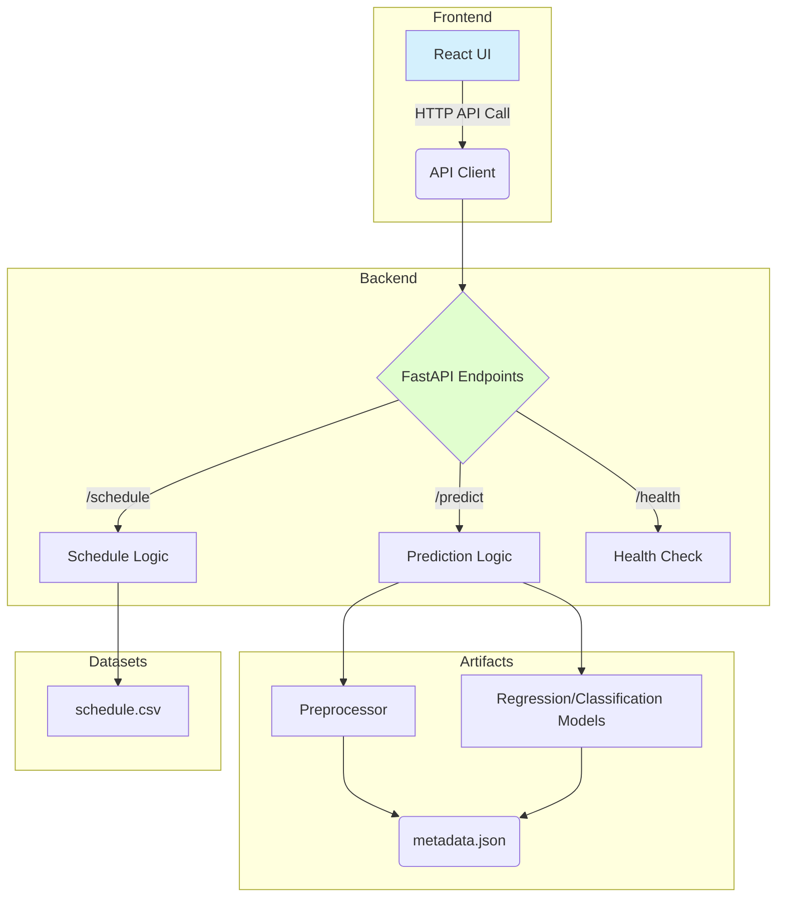

# Architecture Map

## 1. Core Components

| Component | Technology | Location | Purpose |
|---|---|---|---|
| **Backend** | Python, FastAPI | `./backend/` | Serves ML predictions, schedule data, and health status. |
| **Frontend** | React, Vite | `./frontend/` | Consumes backend APIs to display predictions and application status. |
| **ML Models**| Scikit-learn, Joblib | `./backend/models/` | Pre-trained models and a preprocessor for inference. |
| **Data** | CSV | `./backend/data/` | Raw and engineered datasets for training and reference. |

## 2. Dependency & Data Flow

## 3. Key Environment Variables

| Variable | Scope | Purpose | Example |
|---|---|---|---|
| `ALLOWED_ORIGINS` | Backend | Comma-separated list of allowed CORS origins. | `"http://localhost:3000,https://*.vercel.app"` |
| `RESTRICT_CORS` | Backend | If "true", restricts origins based on `ALLOWED_ORIGINS`. | `"true"` |
| `DATASET_PATH` | Backend | Overrides the default path to the training dataset. | `"backend/data/my_custom_data.csv"` |
| `SCHEDULE_PATH` | Backend | Overrides the default path to the NFL schedule CSV. | `"backend/data/custom_schedule.csv"` |
| `VITE_API_URL` | Frontend | Sets the base URL for the backend API in production builds. | `"https://your-heroku-app.herokuapp.com"` |

## 4. Ownership & Entrypoints

- **Backend Entrypoint**: `backend.main:app` (run with `uvicorn`).
- **Frontend Entrypoint**: `frontend/src/index.jsx` (run with `vite`).
- **Model Training**: `backend/train_models.py`.
- **Primary Dataset**: `backend/data/merge_dominance.csv`.
