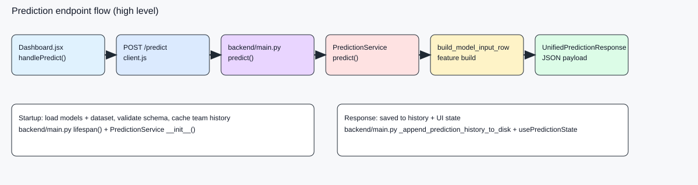

# Prediction Endpoint Map

This document maps the /predict endpoint end-to-end, including request/response models,
dataflow, and the main code locations with line references.

## Image (static)



## Diagram (Mermaid)

```mermaid
flowchart LR
  UI[Dashboard.jsx handlePredict] --> API[predictGame -> POST /predict]
  API --> Main[backend/main.py predict()]
  Main --> Service[PredictionService.predict()]
  Service --> Features[build_model_input_row()]
  Features --> Models[preprocessor + home_reg + away_reg + win_clf]
  Models --> Response[UnifiedPredictionResponse]
  Response --> UI
```

## Dataflow (step-by-step)

| Step | Location | Input -> Output | Notes |
| --- | --- | --- | --- |
| 1 | `frontend/src/components/DashBoard/Dashboard.jsx:55` | user click -> prediction payload | Builds payload from schedule row. |
| 2 | `frontend/src/api/client.js:44` | payload -> POST /predict | Sends JSON to backend. |
| 3 | `backend/main.py:336` | PredictionRequest -> UnifiedPredictionResponse | Endpoint entrypoint. |
| 4 | `backend/services/prediction_service.py:96` | request -> feature row | Calls build_model_input_row. |
| 5 | `backend/services/inference_row.py:366` | context -> aligned feature row | Rolls forward priors, aligns schema, imputes medians. |
| 6 | `backend/services/prediction_service.py:108` | feature row -> scores/probabilities | Preprocess + model inference. |
| 7 | `backend/main.py:123` | model output -> unified response | Flattens response and enriches names. |
| 8 | `backend/main.py:341` | response -> history append | Stores prediction history on disk. |
| 9 | `frontend/src/utils/predictionHelpers.js:25` | raw response -> UI entry | Normalizes to flat entry. |
| 10 | `frontend/src/hooks/usePredictionState.js:237` | entry -> UI state | Stores prediction and history. |

## Data Model (API contract)

### Request model

Defined in `backend/schemas.py:19`.

```json
{
  "home_team": "BUF",
  "away_team": "KC",
  "season": 2025,
  "week": 1
}
```

### Response model

Defined in `backend/schemas.py:49`.

```json
{
  "home_score": 24.2,
  "away_score": 20.8,
  "point_diff": 3.4,
  "home_win_probability": 0.62,
  "away_win_probability": 0.38,
  "prediction_source": "dataset_exact",
  "win_classifier_used": true,
  "simulation_metrics": null,
  "game_id": "2025-1-BUF-KC",
  "season": 2025,
  "week": 1,
  "home_team": "BUF",
  "away_team": "KC",
  "home_name": "Buffalo Bills",
  "away_name": "Kansas City Chiefs"
}
```

## ML Model (inference stack)

Core stack in `backend/services/prediction_service.py:90`:

- home_reg: predicts home score.
- away_reg: predicts away score.
- win_clf: optional classifier to map probabilities.
- preprocessor: transforms the raw feature row if needed.

Feature assembly in `backend/services/inference_row.py:366`:

- Uses dataset exact rows when possible.
- Otherwise synthesizes a row, rolls forward priors/rollups, then aligns to model features.
- Applies median fill for missing numeric columns.

## Usage map (where /predict is called)

| Use | Location |
| --- | --- |
| UI trigger and payload build | `frontend/src/components/DashBoard/Dashboard.jsx:55` |
| HTTP request to backend | `frontend/src/api/client.js:44` |
| Unified response normalization | `frontend/src/utils/predictionHelpers.js:25` |
| State storage for UI/history | `frontend/src/hooks/usePredictionState.js:237` |
| FastAPI endpoint definition | `backend/main.py:336` |
| Prediction inference logic | `backend/services/prediction_service.py:90` |
| Feature row builder | `backend/services/inference_row.py:366` |
| Contract tests | `backend/tests/test_api_endpoints.py:69`, `backend/tests/test_endpoints.py:36` |

## Important code blocks (with line references)

| Block | Why it matters |
| --- | --- |
| `backend/main.py:184` | Startup loads models and dataset, validates schema. |
| `backend/main.py:123` | Flattens model output into UnifiedPredictionResponse. |
| `backend/main.py:336` | /predict endpoint entrypoint. |
| `backend/services/prediction_service.py:96` | Calls build_model_input_row and runs inference. |
| `backend/services/inference_row.py:366` | Core feature build and alignment logic. |
| `backend/schemas.py:19` | PredictionRequest contract. |
| `backend/schemas.py:49` | UnifiedPredictionResponse contract. |
| `frontend/src/api/client.js:44` | Fetch wrapper for POST /predict. |
| `frontend/src/components/DashBoard/Dashboard.jsx:55` | UI handler that triggers predictions. |
| `frontend/src/utils/predictionHelpers.js:25` | Normalizes response into UI entry. |
