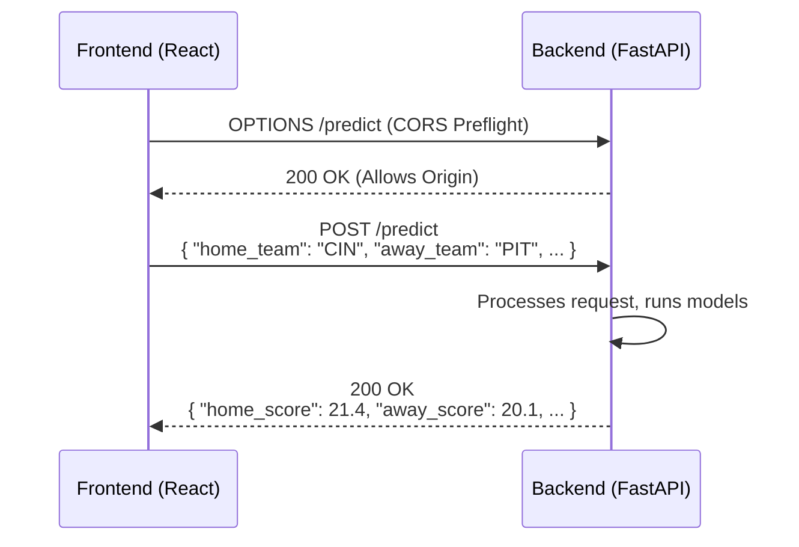

# Frontend Data & Communication Flow

This document outlines the data flow for handling predictions, managing history, and communicating with the backend API.

## 1. Prediction & History State Management

The application uses React's Context API (`PredictionContext.js`) combined with a `useReducer` hook to manage global state for predictions. This ensures that when a prediction is made, all relevant components update consistently.

### Data Flow Diagram

```mermaid
graph TD
    subgraph TeamGrid Component
        A[User Clicks Matchup Card] --> B{handlePredict};
    end

    subgraph API & Context
        B --> C{apiClient.predictGame};
        C --> D[Backend API POST /predict];
        D --> E{Prediction Result};
        E --> F{toEntry (Normalize Data)};
        F --> G[PredictionContext Actions];
    end

    subgraph PredictionContext
        G --> H{actions.setCurrent};
        G --> I{actions.pushHistory};
        H --> J[State: `current` Updated];
        I --> K[State: `history` Updated];
    end

    subgraph UI Components
        J --> L[PredictionResult Component Renders];
        K --> M[HistoryChart Component Renders];
    end

    style D fill:#f9f,stroke:#333,stroke-width:2px
    style L fill:#bbf,stroke:#333,stroke-width:2px
    style M fill:#bbf,stroke:#333,stroke-width:2px
```

### Step-by-Step Breakdown

1.  **User Interaction**: The flow begins in `TeamGrid.jsx` when a user clicks on a matchup card. This triggers the `handlePredict` function.

2.  **API Call**: `handlePredict` calls `predictGame` from `api/client.js`, which sends a `POST` request to the backend's `/predict` endpoint.

3.  **State Update**:
    *   Upon receiving a successful response, `handlePredict` uses the `toEntry` utility function from `PredictionContext.js` to format the API response into a standardized object.
    *   It then calls two actions from the `PredictionContext`:
        *   `actions.setCurrent(entry)`: Updates the `current` prediction object in the global state.
        *   `actions.pushHistory(entry)`: Prepends the new prediction object to the `history` array in the global state.

4.  **Component Re-render**:
    *   The `DashBoard.jsx` component consumes the `PredictionContext`.
    *   When the `state.current` object changes, it passes the new data to the `PredictionResult.jsx` component, which re-renders to show the latest prediction.
    *   When the `state.history` array changes, it passes the updated array to the `HistoryChart.jsx` component, which re-renders to display the updated prediction history.

### Key Code Snippets

**`TeamGrid.jsx` - `handlePredict` function**
```javascript
// ...
import {usePredictions, toEntry} from '../PredictionContext.js';

function TeamGrid() {
  const {actions} = usePredictions();
  // ...

  const handlePredict = async (game) => {
    // ... API call logic ...
    const result = await predictGame(payload);

    // Create a normalized entry and update context
    const entry = toEntry({
      ...game,
      ...result,
      home_abbr: game.home_abbr,
      away_abbr: game.away_abbr,
    });
    actions.setCurrent(entry);
    actions.pushHistory(entry);
  };
  // ...
}
```

**`PredictionContext.js` - Reducer and `toEntry` function**
```javascript
function reducer(state, action) {
  switch (action.type) {
    case 'SET_CURRENT':
      return {...state, current: action.payload};
    case 'PUSH_HISTORY':
      return {...state, history: [action.payload, ...state.history]};
    // ...
  }
}

export function toEntry({ home_abbr, away_abbr, home_score, away_score, ... }) {
  return {
    ts: new Date().toISOString(),
    game: { home_abbr, away_abbr, ... },
    metrics: { home_score, away_score, ... },
    probs: { ... },
  };
}
```

---

## 2. TeamGrid Card Rendering

The `TeamGrid.jsx` component is responsible for fetching the weekly schedule and rendering a card for each matchup.

1.  **Data Fetching**: An initial `useEffect` hook calls `getNextWeekSchedule()` from `api/client.js`. The result, an array of game objects, is stored in the `schedule` state variable.

2.  **Rendering**: The component maps over the `schedule` array. For each `game` object in the array, it renders a matchup card.

    *   A unique `key` is assigned to each card for efficient re-renders.
    *   The `game` object (containing team abbreviations, kickoff time, etc.) is passed to the card's `onClick` handler (`handlePredict`).
    *   The local `predictions` state is used to display the result directly on the card after a prediction is made.

### `TeamGrid.jsx` - Rendering Logic

```jsx
// ...
  if (schedule.length === 0) {
    return <p>Loading next week's matchups...</p>;
  }

  return (
    <div className="team-grid-cards">
      {schedule.map((game, index) => {
        const gameKey = `${game.home_abbr}-${game.away_abbr}`;
        const prediction = predictions[gameKey];

        return (
          <div
            key={`${game.season}-${game.week}-${index}`}
            className="matchup-card"
            onClick={() => handlePredict(game)}
          >
            {/* ... Card content using game.home_abbr, game.away_abbr ... */}

            {prediction && (
              <div className="prediction-result">
                {/* ... Display prediction.home_score, etc. ... */}
              </div>
            )}
          </div>
        );
      })}
    </div>
  );
// ...
```

---

## 3. Frontend-Backend Communication

Communication is handled by a dedicated API client (`src/api/client.js`) that abstracts `fetch` calls.

### Sequence Diagram



### Communication Layers

1.  **Component Layer (`TeamGrid.jsx`)**: Initiates the call with a structured `payload`.
    ```javascript
    const payload = {
      home_team: game.home_abbr,
      away_team: game.away_abbr,
      season: game.season,
      week: game.week,
    };
    const result = await predictGame(payload);
    ```

2.  **API Client Layer (`api/client.js`)**: Handles the `fetch` request, serializes the body, and sets headers.
    ```javascript
    export async function predictGame(body) {
      return api('predict', {method: 'POST', body: JSON.stringify(body)});
    }
    ```

3.  **Backend Endpoint (`backend/main.py`)**: A FastAPI route receives the request, validates it against the `PredictionRequest` Pydantic model, and returns a `PredictionResponse`.
    ```python
    @app.post("/predict", response_model=PredictionResponse)
    def predict_game(payload: PredictionRequest):
        # ... prediction logic ...
        return PredictionResponse(
            home_score=round(home_score, 1),
            away_score=round(away_score, 1),
            # ...
        )
    ```
This architecture decouples the UI from the API, centralizes state management, and ensures a predictable, one-way data flow.
